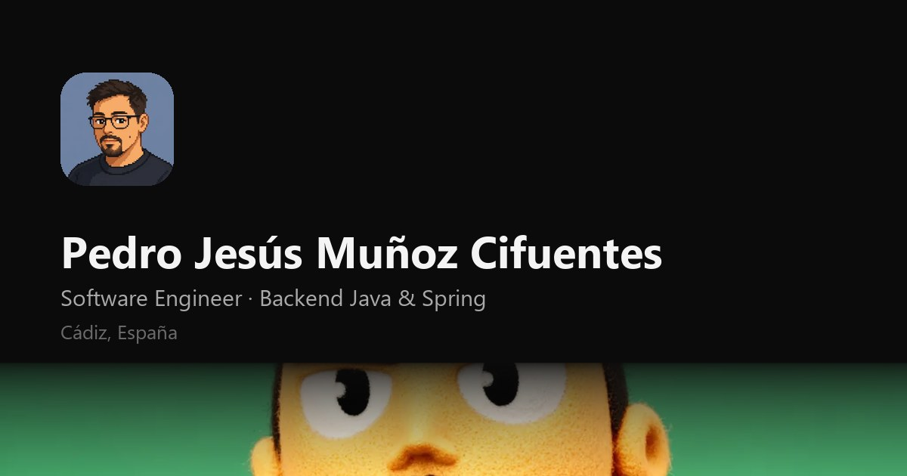

# Portfolio — Pedro Jesús Muñoz Cifuentes

Portfolio personal de un ingeniero de software backend. HTML, CSS y JavaScript planos:
**sin framework, sin dependencias y sin paso de compilación**. Se clona, se abre y funciona.



## Qué incluye

- **Tema claro y oscuro** — respeta la preferencia del sistema y recuerda la elección
- **Español e inglés** — cambio instantáneo, sin recargar; todos los textos en un archivo
- **Galería de arte generativo** con visor a pantalla completa
- **Página 404 con un Snake jugable** — teclado, cruceta y gestos táctiles
- **Sonidos de interfaz de 8 bits** sintetizados con Web Audio, apagados por defecto
- Reproductor de Spotify, contador de visitas y formulario de contacto sin backend
- Responsive verificado a 1280, 768 y 390 px

## Stack

| | |
|---|---|
| Estructura | HTML5 semántico |
| Estilos | CSS con variables nativas, sin preprocesador |
| Lógica | JavaScript sin dependencias (~450 líneas) |
| Herramientas | Python + Pillow para optimizar imágenes |
| Alojamiento | Cloudflare Pages |

Peso desplegado: **2,4 MB**, de los cuales casi todo es la galería, que carga en diferido.
Cero peticiones a terceros salvo el reproductor de Spotify y el contador de visitas.

## Estructura

```
.
├── index.html              Página principal
├── 404.html                Error 404 con el juego
├── _headers                Caché y cabeceras de seguridad (Cloudflare)
├── robots.txt
├── sitemap.xml
├── assets/
│   ├── styles.css          Tokens, temas y componentes
│   ├── app.js              CONFIG + lógica de la página
│   ├── i18n.js             Todos los textos, en ES y EN
│   ├── gallery.js          Generado — manifiesto de la galería
│   ├── sfx.js              Sonidos sintetizados
│   └── arcade.js           Garden Snake
├── fonts/                  Geist, Geist Pixel y JetBrains Mono
├── icons/                  Logos de tecnologías (devicon)
├── images/
│   └── arte/               Originales; las versiones web van en arte/web/
└── tools/
    └── build-gallery.py    Optimiza imágenes y genera el manifiesto
```

## Desarrollo

No hace falta instalar nada para verlo:

```bash
python -m http.server 4175
```

Y abrir <http://localhost:4175>.

> Ábrelo por el servidor, no con doble clic. En `file://` el navegador bloquea las fuentes
> autoalojadas por CORS y no verías la tipografía real.

## Actualizar contenido

### Textos

Todos viven en `assets/i18n.js`, en los dos idiomas. Para cambiar una frase, edítala en
`es` y en `en`.

### Foto de perfil

Deja la imagen en `images/` como `perfil.png` (también vale `.jpg`, `.jpeg` o `.webp`) y
ejecuta el script de abajo. Si falta, se muestra un monograma en su lugar.

### Galería

1. Suelta los archivos en `images/arte/` — valen los nombres tal cual salen de Midjourney
2. Ejecuta:

```bash
python -m pip install Pillow        # solo la primera vez
python tools/build-gallery.py
```

El script optimiza cada imagen a WebP (una grande para el visor y una miniatura para la
rejilla), limpia el nombre del archivo para usarlo como título, regenera el avatar y la
tarjeta de redes sociales, y escribe `assets/gallery.js`.

En la primera pasada real: **31,8 MB → 2,0 MB**.

> **Guarda los originales fuera del repositorio.** No se suben (`.gitignore`) y el sitio
> no los necesita, pero sin ellos no puedes regenerar la galería con otra calidad o
> tamaño. Si ejecutas el script sin originales, detecta las imágenes ya optimizadas en
> `images/arte/web/`, reconstruye el manifiesto conservando los títulos y no borra nada.

### Configuración

En `assets/app.js`, al principio:

```js
const CONFIG = {
  web3formsKey:     '',   // formulario real; vacío = abre el cliente de correo
  cfBeaconToken:    '',   // Cloudflare Web Analytics; vacío = no carga nada
  visitorNamespace: '',   // contador de visitas
  email:            '…'
};
```

### Playlists de Spotify

Los reproductores están escritos directamente en `index.html`, en
`<section id="musica">`. Se sustituyen pegando el iframe que da Spotify en
**Compartir → Insertar playlist**.

## Despliegue

Cloudflare Pages, sin build:

| Campo | Valor |
|---|---|
| Framework preset | None |
| Build command | *(vacío)* |
| Build output directory | `/` |

Si el repositorio contuviera este proyecto dentro de una subcarpeta, esa subcarpeta sería
el *output directory*.

> **Al cambiar CSS o JS, sube el número de `?v=` en los `<script>` y el `<link>` de
> `index.html` y `404.html`.** Sin eso, quien ya haya visitado seguirá viendo la versión
> cacheada.

## Accesibilidad

- Navegación completa por teclado, con foco visible
- `prefers-reduced-motion` desactiva el rol rotativo y las transiciones
- Los sonidos están apagados por defecto
- Etiquetas ARIA en controles, y `alt` en todas las imágenes
- Contraste conforme a WCAG AA en ambos temas

## Créditos

- Tipografías **Geist** y **Geist Pixel** ([Vercel](https://vercel.com/font)) y
  **JetBrains Mono** ([JetBrains](https://www.jetbrains.com/lp/mono/)), bajo licencia
  SIL Open Font License 1.1
- Iconos de tecnologías de [devicon](https://devicon.dev) (MIT)
- Contador de visitas: [Abacus](https://abacus.jasoncameron.dev)
- El sistema visual está inspirado en el portfolio de
  [Siddharth Meena](https://siddz.com): estructura de secciones, columna estrecha y
  contraste entre tipografía monoespaciada y sans. El contenido, las imágenes y el código
  son propios.

## Licencia

El código es libre de reutilizar. El contenido personal —textos, fotografías y las
imágenes de la galería— no.

---

**Pedro Jesús Muñoz Cifuentes** · Software Engineer · Cádiz, España
